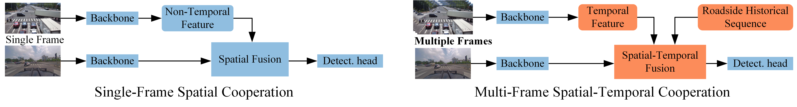
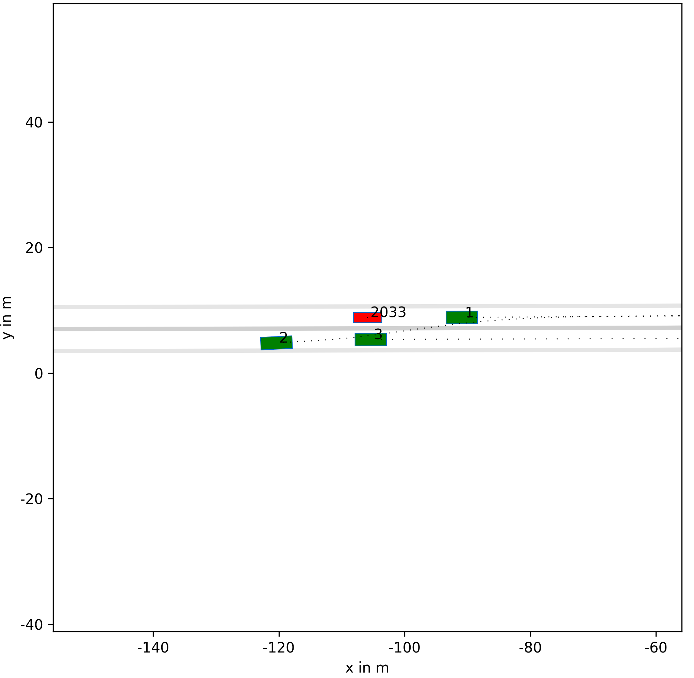

# Abstract

  

  Infrastructure sensors installed at elevated positions offer a broader perception range and encounter fewer occlusions. Integrating both infrastructure and ego-vehicle data through V2X communication, known as vehicle-infrastructure cooperation, has shown considerable advantages in enhancing perception capabilities and addressing corner cases encountered in single-vehicle autonomous driving.
However, cooperative perception still faces numerous challenges, including limited communication bandwidth and practical communication interruptions.
In this paper, we propose CTCE, a novel framework for cooperative 3D object detection. This framework transmits queries with temporal contexts enhancement, effectively balancing transmission efficiency and performance to accommodate real-world communication conditions.
Additionally, we propose a temporal-guided fusion module to further improve performance. The roadside temporal enhancement and vehicle-side spatial-temporal fusion together constitute a multi-level temporal contexts integration mechanism, fully leveraging temporal information to enhance performance.
Furthermore, a motion-aware reconstruction module is introduced to recover lost roadside queries due to communication interruptions.
Experimental results on V2X-Seq and V2X-Sim datasets demonstrate that CTCE outperforms the baseline QUEST, achieving improvements of $3.8\%$ and $1.3\%$ in mAP, respectively. Experiments under communication interruption conditions validate CTCE's robustness to communication interruptions.

# Method

  

<!--
# 3. Experiments

## 1) Experiments details

  

## 2) Baseline Compare

  <figure style="display: flex; flex-direction: column; align-items: center; margin-bottom: 20px; height: 400px;">
    
    <figcaption>Physical-based</figcaption>
  </figure>
  <figure style="display: flex; flex-direction: column; align-items: center; margin-bottom: 20px; height: 400px;">
    
    <figcaption>GRIP++</figcaption>
  </figure>
  <figure style="display: flex; flex-direction: column; align-items: center; margin-bottom: 20px; height: 400px;">
    
    <figcaption>WaleNet</figcaption>
  </figure>

  <figure style="display: flex; flex-direction: column; align-items: center; margin-bottom: 20px; height: 400px;">
    
    <figcaption>Trajectron++</figcaption>
  </figure>
  <figure style="display: flex; flex-direction: column; align-items: center; margin-bottom: 20px; height: 400px;">
    
    <figcaption>POP</figcaption>
  </figure>

## 2) Planning performance

### a) Non-reactive

  <figure style="display: flex; flex-direction: column; align-items: center; margin: 0 20px 20px 0; height: 400px;">
    
    <figcaption></figcaption>
  </figure>
  <figure style="display: flex; flex-direction: column; align-items: center; margin: 0 20px 20px 0; height: 400px;">
    
    <figcaption></figcaption>
  </figure>
  <figure style="display: flex; flex-direction: column; align-items: center; margin: 0 0 20px 0; height: 400px;">
    
    <figcaption></figcaption>
  </figure>

  <figure style="display: flex; flex-direction: column; align-items: center; margin-bottom: 20px; height: 400px;">
    
    <figcaption></figcaption>
  </figure>
  <figure style="display: flex; flex-direction: column; align-items: center; margin-bottom: 20px; height: 400px;">
    
    <figcaption></figcaption>
  </figure>
  <figure style="display: flex; flex-direction: column; align-items: center; margin-bottom: 20px; height: 400px;">
    
    <figcaption></figcaption>
  </figure>

### b) Reactive

  <figure style="display: flex; flex-direction: column; align-items: center; margin-bottom: 20px;">
    
    <figcaption></figcaption>
  </figure>

-->
