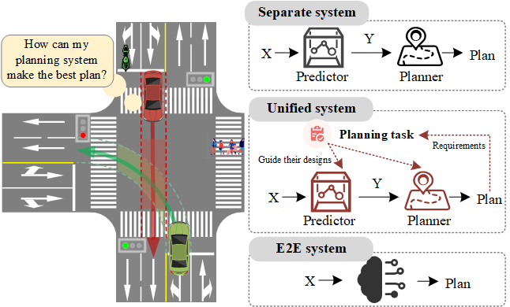
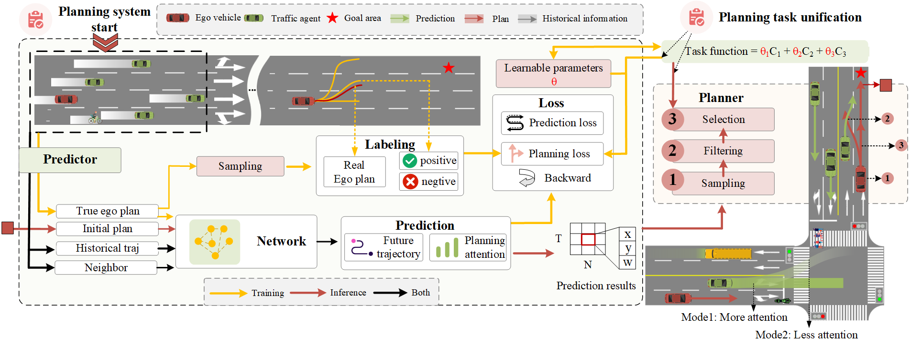
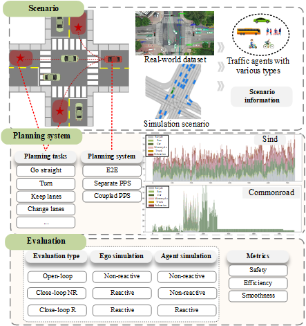

Text can be **bold**, _italic_, or ~~strikethrough~~.




# 1. Abstract

  Autonomous driving is developing rapidly and has become a hot topic in both industry and research. The planning system plays a crucial role in meeting the requirements of autonomous driving, such as safety and effectiveness. However, current planning system designs may not effectively serve planning tasks. A typical modular planning system offers high interpretability and flexibility. However, it may cause task-agnostic problems between the upstream predictor and the downstream planner. End-to-end driving systems have a natural advantage in achieving system-wide integration, but their poor interpretability poses safety risks. To leverage the strengths and mitigate the weaknesses of existing systems, a task-unified planning framework is proposed, aiming to inspire the current prediction-planning paradigm. In this architecture, driving tasks are first modeled. Then, the predictor and planner are jointly designed and optimized based on the driving tasks. Finally, during the actual planning process, the upstream and downstream components remain relatively independent to allow flexible adjustments. The core of this architecture is a planning-oriented predictor named POP, which fully retains the advantages of modular systems by designing the predictor to optimize driving requirements. Comprehensive experiments demonstrate its effectiveness. Compared with typical modular systems, POP can reduce collision scenarios by nearly 50%, ensuring system safety without compromising driving efficiency or comfort, significantly enhancing overall planning performance.

# 2. Method

  

# 3. Experiments

## 1) Experiments details

  

## 2) Baseline Compare

<div style="display: flex; flex-direction: row; justify-content: center;">
  <figure style="display: flex; flex-direction: column; align-items: center; margin-bottom: 20px;">
    
    <figcaption>Physical-based</figcaption>
  </figure>
  <figure style="display: flex; flex-direction: column; align-items: center; margin-bottom: 20px;">
    
    <figcaption>GRIP++</figcaption>
  </figure>
  <figure style="display: flex; flex-direction: column; align-items: center; margin-bottom: 20px;">
    
    <figcaption>WaleNet</figcaption>
  </figure>
</div>

<div style="display: flex; flex-direction: row; justify-content: center;">
  <figure style="display: flex; flex-direction: column; align-items: center; margin-bottom: 20px;">
    
    <figcaption>Trajectron++</figcaption>
  </figure>
  <figure style="display: flex; flex-direction: column; align-items: center; margin-bottom: 20px;">
    
    <figcaption>POP</figcaption>
  </figure>
</div>


## Header 2

> This is a blockquote following a header.
>
> When something is important enough, you do it even if the odds are not in your favor.

### Header 3

```js
// Javascript code with syntax highlighting.
var fun = function lang(l) {
  dateformat.i18n = require('./lang/' + l)
  return true;
}
```

```ruby
# Ruby code with syntax highlighting
GitHubPages::Dependencies.gems.each do |gem, version|
  s.add_dependency(gem, "= #{version}")
end
```

#### Header 4

*   This is an unordered list following a header.
*   This is an unordered list following a header.
*   This is an unordered list following a header.

##### Header 5

1.  This is an ordered list following a header.
2.  This is an ordered list following a header.
3.  This is an ordered list following a header.

###### Header 6

| head1        | head two          | three |
|:-------------|:------------------|:------|
| ok           | good swedish fish | nice  |
| out of stock | good and plenty   | nice  |
| ok           | good `oreos`      | hmm   |
| ok           | good `zoute` drop | yumm  |

### There's a horizontal rule below this.

* * *

### Here is an unordered list:

*   Item foo
*   Item bar
*   Item baz
*   Item zip

### And an ordered list:

1.  Item one
1.  Item two
1.  Item three
1.  Item four

### And a nested list:

- level 1 item
  - level 2 item
  - level 2 item
    - level 3 item
    - level 3 item
- level 1 item
  - level 2 item
  - level 2 item
  - level 2 item
- level 1 item
  - level 2 item
  - level 2 item
- level 1 item

### Small image


### Large image


### Definition lists can be used with HTML syntax.

<dl>
<dt>Name</dt>
<dd>Godzilla</dd>
<dt>Born</dt>
<dd>1952</dd>
<dt>Birthplace</dt>
<dd>Japan</dd>
<dt>Color</dt>
<dd>Green</dd>
</dl>

```
Long, single-line code blocks should not wrap. They should horizontally scroll if they are too long. This line should be long enough to demonstrate this.
```

```
The final element.
```
