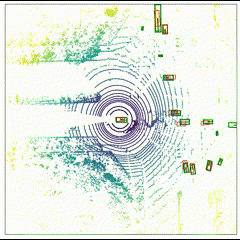
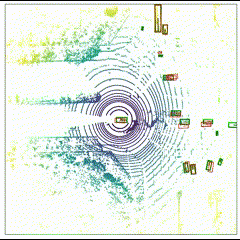
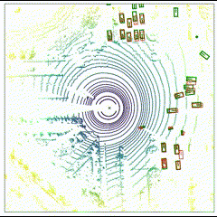

# Leveraging Temporal Contexts to Enhance Vehicle-Infrastructure Cooperative Perception
by Jiaru Zhong, Haibao Yu, Tianyi Zhu, Jiahui Xu, Wenxian Yang, Zaiqing Nie, Chao Sun

## Results

  <figure style="display: flex; flex-direction: column; align-items: center; margin-bottom: 20px; height: 400px;">
    
    <figcaption>Under Interruptions w/o Compensation</figcaption>
  </figure>
  <figure style="display: flex; flex-direction: column; align-items: center; margin-bottom: 20px; height: 400px;">
    
    <figcaption>Under Interruptions w/ Compensation</figcaption>
  </figure>
  <figure style="display: flex; flex-direction: column; align-items: center; margin-bottom: 20px; height: 400px;">
    
    <figcaption>Under Ideal Condition</figcaption>
  </figure>

<!--
# 3. Experiments

## 1) Experiments details

  

## 2) Baseline Compare

  <figure style="display: flex; flex-direction: column; align-items: center; margin-bottom: 20px; height: 400px;">
    
    <figcaption>Physical-based</figcaption>
  </figure>
  <figure style="display: flex; flex-direction: column; align-items: center; margin-bottom: 20px; height: 400px;">
    
    <figcaption>GRIP++</figcaption>
  </figure>
  <figure style="display: flex; flex-direction: column; align-items: center; margin-bottom: 20px; height: 400px;">
    
    <figcaption>WaleNet</figcaption>
  </figure>

  <figure style="display: flex; flex-direction: column; align-items: center; margin-bottom: 20px; height: 400px;">
    
    <figcaption>Trajectron++</figcaption>
  </figure>
  <figure style="display: flex; flex-direction: column; align-items: center; margin-bottom: 20px; height: 400px;">
    
    <figcaption>POP</figcaption>
  </figure>

## 2) Planning performance

### a) Non-reactive

  <figure style="display: flex; flex-direction: column; align-items: center; margin: 0 20px 20px 0; height: 400px;">
    
    <figcaption></figcaption>
  </figure>
  <figure style="display: flex; flex-direction: column; align-items: center; margin: 0 20px 20px 0; height: 400px;">
    
    <figcaption></figcaption>
  </figure>
  <figure style="display: flex; flex-direction: column; align-items: center; margin: 0 0 20px 0; height: 400px;">
    
    <figcaption></figcaption>
  </figure>

  <figure style="display: flex; flex-direction: column; align-items: center; margin-bottom: 20px; height: 400px;">
    
    <figcaption></figcaption>
  </figure>
  <figure style="display: flex; flex-direction: column; align-items: center; margin-bottom: 20px; height: 400px;">
    
    <figcaption></figcaption>
  </figure>
  <figure style="display: flex; flex-direction: column; align-items: center; margin-bottom: 20px; height: 400px;">
    
    <figcaption></figcaption>
  </figure>

### b) Reactive

  <figure style="display: flex; flex-direction: column; align-items: center; margin-bottom: 20px;">
    
    <figcaption></figcaption>
  </figure>

-->
